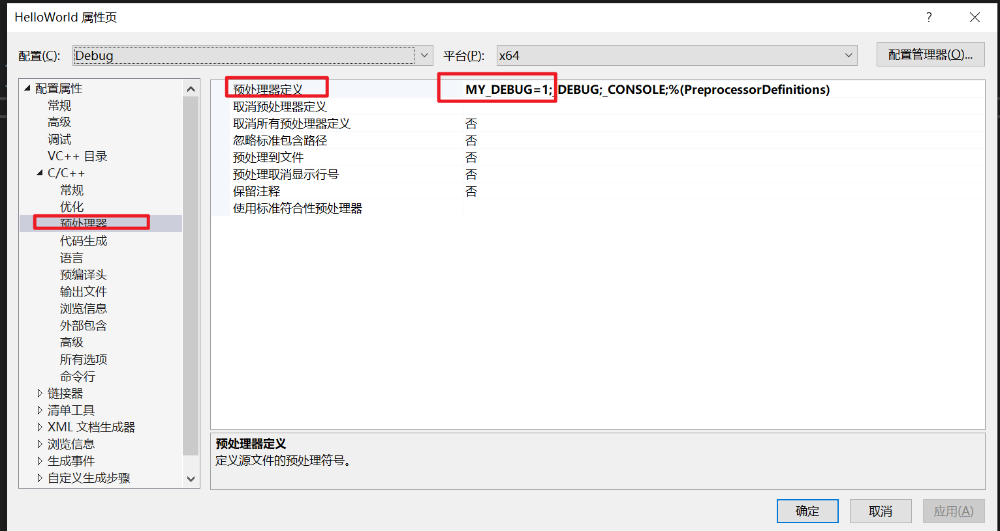

# VisualStudio的最佳设置
1. 新建项目

2. 点击显示所有文件,右键新建src文件夹用来放源码

3. 修改解决方案的属性
输出目录改为: \$(SolutionDir)bin\$(Platform)\$(Configuration)\
中间目录改为: \$(SolutionDir)intermediates\bin\$(Platform)\$(Configuration)\


# 通过两个类的定义来快速学习与回顾C++的知识点
> 包含的知识点有:
> **防卫式声明**
> **成员初始化列表**
> **this关键字**
> **符号重载**
> **友元函数**
> **内联函数**
> **拷贝赋值与拷贝构造**

---
## complex.h(没有传指针的类)
```cpp
// 防卫式声明
#ifndef __MYCOMPLEX__
#define __MYCOMPLEX__

class complex;  // 声明类
//声明三个函数,返回类型为complex的引用
complex&
  __doapl (complex* ths, const complex& r);
complex&
  __doami (complex* ths, const complex& r);
complex&
  __doaml (complex* ths, const complex& r);


class complex
{
public:
  complex (double r = 0, double i = 0): re (r), im (i) { } // 以初值列的形式定义构造函数,接收r和i两个参数,将r参数给变量re,i给变量im,函数体为空
  // 重载各种运算符号
  complex& operator += (const complex&); 
  complex& operator -= (const complex&);
  complex& operator *= (const complex&);
  complex& operator /= (const complex&);
  // 定义real和imag函数,因为这两个函数里没有改动data,所以要加const
  double real () const { return re; }
  double imag () const { return im; }
private:
  double re, im;
  // 将这三个函数作为complex这个类的友元函数,这样的话这三个函数就可以取得complex这个类的私有的成员
  friend complex& __doapl (complex *, const complex&);
  friend complex& __doami (complex *, const complex&);
  friend complex& __doaml (complex *, const complex&);
};

// 定义__doapl函数,因为这个函数比较简单,所以定义为inline(内联函数),内联函数更快. 如果一个函数在类中定义的话,那么编辑器会自动尝试将其作为内联函数.
// 定义为内敛函数并不代表它就一定会成为内联函数,编辑器会根据inline的添加而尝试将其作为内联函数,因为编辑器需要判断函数是否复杂.
inline complex&
__doapl (complex* ths, const complex& r)
{
  ths->re += r.re;
  ths->im += r.im;
  return *ths;
}
 
// complex&是返回值的类型
// complex::意思是这个是complex这个类的成员函数
// 重载+=运算符,a+=b的话a会作为this来传递进来,this是一个指向a的指针.
// 因为返回的东西不是local变量,不会执行完函数以后就消失,因此可以返回引用类型.
// 因为参数r是不会改变的,所以前面加const
// 传进来的参数设定为引用类型和值类型的区别: 传值的话就是传这个值的全部,这个值的空间大小有多大就传多大,但是传引用的话是传地址,占用的空间大小是通常是比较小的,所以通常建议传引用.
// 将重载+=这个函数设定为complex的成员函数是因为这个+=是只针对complex这个类的,如果是想要非complex类能够使用这个运算符就需要将其定义为全局函数
inline complex&
complex::operator += (const complex& r)
{ 
  return __doapl (this, r);
}

inline complex&
__doami (complex* ths, const complex& r)
{
  ths->re -= r.re;
  ths->im -= r.im;
  return *ths;
}
 
inline complex&
complex::operator -= (const complex& r)
{
  return __doami (this, r);
}
 
inline complex&
__doaml (complex* ths, const complex& r)
{
  double f = ths->re * r.re - ths->im * r.im;
  ths->im = ths->re * r.im + ths->im * r.re;
  ths->re = f;
  return *ths;
}

inline complex&
complex::operator *= (const complex& r)
{
  return __doaml (this, r);
}
 
inline double
imag (const complex& x)
{
  return x.imag ();
}

inline double
real (const complex& x)
{
  return x.real ();
}

inline complex
operator + (const complex& x, const complex& y)
{
  return complex (real (x) + real (y), imag (x) + imag (y)); // 通过此语法来返回complex的临时对象,不需要给对象起名字.
}

inline complex
operator + (const complex& x, double y)
{
  return complex (real (x) + y, imag (x));
}

inline complex
operator + (double x, const complex& y)
{
  return complex (x + real (y), imag (y));
}

#include <cmath>

inline complex
polar (double r, double t)
{
  return complex (r * cos (t), r * sin (t));
}

inline complex
conj (const complex& x) 
{
  return complex (real (x), -imag (x));
}

inline double
norm (const complex& x)
{
  return real (x) * real (x) + imag (x) * imag (x);
}

//防卫式声明
#endif   //__MYCOMPLEX__  
```

---
## string.h(传指针的类)
```cpp
#ifndef __MYSTRING__
#define __MYSTRING__

class String
{
public:                                 
   String(const char* cstr=0);  // 类接收的是指针                   
   String(const String& str);   // 因为有指针,因此需要声明拷贝构造函数,接收的是自己
   String& operator=(const String& str); // 因为有指针,因此需要声明拷贝赋值函数,接收的是自己
   ~String(); // 析构函数,对象的生命结束时使用                                 
   char* get_c_str() const { return m_data; }
private:
   char* m_data; // 因为字符串的大小是不固定的,因此将去设为指针,就可以通过动态分配内存的方式来存了.
};

#include <cstring>


// 构造函数的定义
inline
String::String(const char* cstr)
{
   if (cstr) {
      m_data = new char[strlen(cstr)+1]; // 分配空间传给指针,结尾有/0来表示结束,因此需要加1
      strcpy(m_data, cstr); // strcpy是<cstring>头文件中带有的函数,通过strcpy将源字符串复制到m_data 中
   }
   else {   
      m_data = new char[1];
      *m_data = '\0';
   }
}

// 析构函数的定义
inline
String::~String()
{
   delete[] m_data;
}

// 拷贝赋值函数的定义
// 之所以需要有拷贝赋值函数,是因为如果使用默认的赋值操作会造成内存泄漏,为什么会内存泄漏:一开始有指针ptra指向a内容,指针ptrb指向b内容,如果是默认的赋值操作,那么最终结果就是ptra和ptrb同时指向其中一个内容,那么另一个内容就没有被指向了,指针丢失,就没办法释放内存,就造成了内存泄漏.
inline
String& String::operator=(const String& str)
{
   if (this == &str) // 如果是自我赋值就不能delete了.
      return *this;

   delete[] m_data; // 因为赋值本身指针已经指向了一个数据,因此需要先delete,避免内存泄漏
   m_data = new char[ strlen(str.m_data) + 1 ];
   strcpy(m_data, str.m_data); // 将来源端拷贝到目的端
   return *this; // 为了能够连续的使用重载的赋值,因此返回*this,不然不能够连续使用重载的赋值,因为这个重载的赋值是string类型使用的.
}

// 拷贝构造函数的定义
// 跟拷贝赋值函数的作用是一样的,避免两个指针指向同一个东西而造成内存泄露.
// 默认编辑器的拷贝是浅拷贝,这是深拷贝
inline
String::String(const String& str)
{
   m_data = new char[ strlen(str.m_data) + 1 ]; // 分配空间
   strcpy(m_data, str.m_data);
}

#include <iostream>
using namespace std;
// 由于这个对于<<的重载是全局的,不是在类中的,所以它的参数是没有this指针的.
// ostream& os对应的是输出流对象,比如std::cout
// 所以这个重载<<相当于支持cout<< String类型.
ostream& operator<<(ostream& os, const String& str)
{
   os << str.get_c_str();
   return os;
}

#endif

```

---
# 防卫式声明
> 在头文件中添加防卫式声明后可以防止程序多次包含这个头文件。
这个防卫式声明的作用跟#program once作用差不多,目前个人喜欢用#program once。


---
# 模板
## 类模板
假如我们现在定义一个名字叫做complex的类，然后它是有实部和虚部的，因此它就需要定义两个变量来充当它的实部和虚部。但是这个实部和虚部的类型可能是int也可能是float等等，这是不一定的。
像这种需要定义变量意义是一样的，但是类型不一定的时候，就可以借助模板了。
> 向下方这些代码一样，我们可以以T来代替类型然后当使用时就可以通过"<>"来指定类型了。

举例一： complex\<double> c1(2.5,1.5);与 complex\<int> c2(2,6)
```cpp
template<typename T> // 告诉编辑器这个T是一个模板
class complex
{
public:
    complex (T r=0, T i=0)
      : re (r), im (i)
    { }
private:
    T re, im;
};
```
举例二:
```cpp
#include <iostream>
#include <string>

template<typename T,int N>
class Array
{
private:
	T m_array[N];
public:
	int GetSize() { return N; }
};

int main()
{
	Array<std::string, 5> array1;
	Array<int, 50> array2;
	std::cout << array1.GetSize() << std::endl;
	std::cout << array2.GetSize() << std::endl;
}
```

## 函数模板
函数模板跟类模板的区别是函数模板在使用时**不强制**需要通过\<>来指定类型是什么,编译器会自动的根据调用函数时传进来的参数类型来进行使用.
只有当调用这个函数时,这个函数才会被实际创建.
> 例如这里定义一个函数min,调用时直接 c = min(a,b)即可,编译器会根据a和b的类型自动替代模板T
```cpp
template <typename T>
inline
const T& min(const T& a, const T& b)
{
  return b < a ? b : a;
}
```


---
# inline(内联)函数
> 在class的本体里面进行定义的函数会自动成为inline函数的**候选人**,之所以是候选人是因为编译器会根据函数的内容的复杂程度来将函数变成inline函数，如果太复杂就无法变成inline函数。
> 在类外面进行定义的函数可以通过添加inline关键字来让编辑器**尽量**将函数变成inline函数

inline函数的好处是比较快。

---
# 构造函数
> 构造函数的作用是当类的对象被创建出来时会自动的进行调用

构造函数的名字需要跟类的名字一样。

---
## 构造函数的特殊语法：initialization list(初值列，初始列)
> 构造函数可以后面可以加:来写赋值的操作，例如下图中将形参r和形参i赋予类的自定义变量re和im


---
# 重载
> 重载的意思是： 允许创建多个名称相同的函数，但是函数所需要的参数需要不同，这样就可以在调用的时候根据传入的参数的个数与类型的不同来调用不同的对应函数

## 操作符重载
操作符是+,-,*,+=,-=,==,!=这些符号.
操作符也可以被重载,只需要在定义与声明的操作符前面加上operator即可
```cpp
#include <iostream>
using namespace std;
struct Vector2
{
	float x;
	float y;
	Vector2(float X, float Y) :x(X), y(Y) {};

	Vector2 Add(const Vector2 other) const {
		return Vector2(x + other.x, y + other.y);
	}

	Vector2 operator +(const Vector2& other) const{
		return Add(other);
	}

	Vector2 multiply(const Vector2 other) const {
		return Vector2(x * other.x, y * other.y);
	}

	Vector2 operator *(const Vector2 other) const {
		return multiply(other);
	}

	bool operator ==(const Vector2 other) const {
		return x == other.x && y == other.y;
	}

};

ostream& operator <<(ostream& stream, const Vector2& vector)  {
	stream << "(" << vector.x << "," << vector.y << ")";
	 return stream;
}

int main()
{
	Vector2 a(1.0f, 2.0f);
	Vector2 b(3.0f, 4.0f);
	cout << "a==" << a << endl;
	cout << "b==" << b << endl;
	cout << "a+b==" << a + b << endl;
	cout << "a*b==" << a * b << endl;
	cout << "a==b:" << (a == b) << endl;

	cin.get();
}

```
---
# const
> const可以用来针对函数也可以用来针对变量.
> const用在类的成员函数上表示这个函数不会修改对象(*this)内部的数据成员.
> const用在对象上表示这个对象不会被进行修改.

**基础类型不需要添加const,因为他们是等效的**
例如const int 与 int是等效的.
基础类型有int,char,bool,float,void这些.

**const针对指针的不同写法的区别:**
const放到*号前面代表,指针指向的内容是不能改变的
const放到*号后面代表,指针的指向是不能改变的(不能够给ptr一个其他的地址),但是指针指向的内容(*ptr)是可以改变的
const int* ptr = int const* ptr != int* const ptr

**如果一个函数不针对参数进行修改一定要记得加上const**.
原因是因为如果一个对象被定义为const,那么这个对象就不能够使用没有被const定义的函数.
- const用在函数上:  函数类型 函数名() const {}
- const用在变量上: const 类名 对象名();

# mutable
> mutable有两种不同的用途,其中之一是与const一起使用,另一种是用在lambda表达式中,或同时覆盖这两种情况.
> mutable绝大部分情况下是用在类中使用的,不会使用在lambda上面
```cpp
#include <iostream>
class Enitity
{
private:
	std::string m_Name = "TestName";
	mutable int m_Debug_num = 0; // 添加mutable可以让const函数中改变
public:
	const std::string& Get_Name() const
	{
		m_Debug_num++;
		std::cout << m_Debug_num << std::endl;
		return m_Name;
	}
};

int main()
{
	const Enitity e;
	for(int i = 0; i < 5 ; i++)
	{
		std::cout << e.Get_Name() << std::endl;
	}
	
	std::cin.get();
}

```

---
# friend友元函数
>类中被定义为private的成员只能被类的函数所访问,但是通过友元函数打开封装的大门.
友元函数可以在类中进行声明,声明以后这个被声明为友元函数的函数就可以访问类的private里的参数了.
**友元函数只需要在类中声明即可,友元函数的定义不需要在类中定义.** 
**相同class的各个object互为友元**,也就是说相同类的obj1和obj2可以互相访问对方的私有成员.

---
# static 静态
> 可以把函数和变量设定为静态的,静态的函数和变量是属于类的,无论创建多少个对象,这个设定为静态的函数和变量都只有一份.
## 静态变量
静态变量只有一份,属于类,不同的对象都是使用的这一份.如果不是静态变量,那么创建多少个对象就会有多少个对应的变量
## 静态函数
静态函数不像其他的类的函数一样有this指针,静态函数是没有this指针的,因此静态函数的定义中是不能够访问类中的其他变量的,静态函数只能够访问静态变量.
静态函数可以通过类名来调用

---
# 继承与多态与虚函数表
## 继承
> 继承代表了 is a 关系
> 子类的范围大小是要比父类要大的
> 构造是由内而外的,先执行父类的构造函数,再执行子类的构造函数.
> 析构是由外而内的,先执行子类的析构函数,再执行父类的析构函数.
> **父类的析构函数必须是virtual**,否则会出现undefined behavior

用下图来表示, Base这个类是父类,Derived这个类是子类.


## 多态与虚函数表
> 多态是面向对象编程中的一种特性，它允许同一个接口调用的不同实现。这种特性使得一个基类指针或引用可以指向派生类的对象，并且可以调用派生类的重载方法，而不需要知道具体的派生类。这种机制主要有两种类型：
1.编译时多态（静态多态性）：通过函数重载和模板实现。
2.运行时多态（动态多态性）：通过虚函数（virtual functions）和继承实现。
在C++中，运行时多态通过虚函数来实现。当基类的一个方法被声明为虚函数，派生类可以重写（override）这个方法。当通过基类指针或引用调用这个方法时，会执行指向对象的实际类型的版本。

> 函数表是由编译器实现的一种机制，用来支持C++的运行时多态性。它是一个指针表，其中包含类的虚函数的地址。每个拥有虚函数的类都有一个虚函数表。具体来说：
虚函数表（vtable）：每个包含虚函数的类都有一个虚函数表，表中包含该类的所有虚函数的地址。
虚指针（vptr）：每个对象包含一个指向该类的虚函数表的指针。当对象创建时，这个指针被初始化指向相应的虚函数表。
当通过基类指针或引用调用虚函数时，程序会通过对象的虚指针找到对应的虚函数表，然后从表中找到实际要调用的函数地址，并进行调用。

## 代码举例
```
#include <iostream>

class Parent
{
public:
	Parent() { std::cout << "进行父类构造函数" << std::endl; }
	virtual ~Parent() { std::cout << "进行父类析构函数" << std::endl; }
	virtual void Print() { std::cout << "执行父类的Print函数"<< std::endl; }
};

class Child : public Parent
{
private:
	int* m_Array;
public: 
	void Print() override {
		std::cout << "执行子类的Print函数" << std::endl; }
	Child() { m_Array = new int[5]; std::cout << "创建内存并进行子类构造函数" << std::endl; }
	~Child() { delete[] m_Array; std::cout << "删除创建的内存并进行子类析构函数" << std::endl; }
};

int main() 
{
	Parent* parent = new Parent(); 
	parent->Print();
	delete parent;
	std::cout << "--------------------" << std::endl;
	Child* child = new Child();
	child->Print();
	delete child;
	std::cout << "--------------------" << std::endl;
	Parent* poly = new Child(); // 基于多态的特性,申请子类的内存去创建指向Parent类型的指针
	poly->Print(); // 因为虚函数表的存在,实际调用的将会是子类的Print函数
	delete poly; // 如果父类的析构函数没有设置成virtual,那么将不会调用子类的析构函数.将会造成内存泄漏


	std::cin.get();
}
```

---
# 复合
> 复合代表了 has a 关系
> 一个类中可以包含其他类,然后可以使用包含的其他类的东西,这种情况叫做复合
> 包含其他类的这个大类可以称之为container(容器),其所包含的类称之为component(组件)
> 构造是由内而外的,先执行component的**默认**构造函数,再执行container的构造函数
> 析构是由外而内的,先执行container的析构函数,再执行component的析构函数

用下图来表示,**菱形是实心的黑色**
意思是Container这个类包含了Component这个类


---
# 委托(又称代理) delegation
> 委托跟复合的区别是,它包含的是其他类的指针,

用下图来表示,**菱形是空心的**,空心可以这样解释:一个拥有其他类,但是因为是指针,不是实实在在的,所以是空心.


---
# virtual&pure virtual 虚函数和纯虚函数
> 虚函数的概念:父类的函数声明前加上virtual,即可将父类的这个函数设定为虚函数,设定为虚函数以后,这个函数就能够被父类的子类重新定义,并且父类本身要有对于这个函数的定义.
> 纯虚函数的概念: 父类的函数声明前加上virtual,然后后面加上"=0",即可将父类的这个函数设定为纯虚函数,纯虚函数必须被父类的子类重新定义,并且父类本身一般没有进行这个函数的定义.

# 转换函数
如图中所示红框黄底的代码就是转换函数,有了这个转换函数后,就可以在进行运算时编译器能够自动地寻找合适的类型来进行运算.
**转换函数是没有返回类型的**


---
# 三元操作符
三元操作符可以实现一行代码就能实现if else功能
```cpp
#include <iostream>
int main()
{
	int a = 5;
	int b = 4;

	std::string c = a > b ? "a大于b" : "a小于b";
	
  /*等同于
	std::string c;
	if (a > b)
		 c = "a大于b";
	else
		 c = "a小于b";
  */
  std::cout << c << std::endl;
	std::cin.get();
}
```
---
# new和delete
**new与delete**
new是用于在堆上动态分配内存的关键字,它会返回一个指向分配的内存的指针
delete用于释放由new分配的动态内存
当使用new时要配合使用delete,当使用new[]时要配合使用delete[]
语法1: 
type* ptr = new type
delete ptr
语法2 分配指定大小:
type* arrayPtr = new type\[size]
delete[] arrayPtr

# 堆与栈
栈与堆,它们是我们可以存储数据的地方,它们的工作原理非常不同,但本质上它们做的事情是一样的.
**栈:**
在函数调用时,函数的局部变量和参数会被存储在栈中.当函数执行完成后,这些数据会被自动释放.
栈的内容分配速度更快,但是大小有限.
栈是由编译器自动管理的,在栈上分配内存就是一条cpu指令
栈分配的内存地址是连续的.
**堆:**
堆是一种动态分配的内存池,是由程序员负责管理的.
堆分配的内存地址不是连续的.
在堆上分配的内存需要手动释放,否则会导致内存泄漏.


---
# 隐式转换和explicit
隐式转换是在没有显式指示的情况下，由编译器自动进行的类型转换。
explicit关键字用于防止构造函数或转换运算符进行隐式转换，仅允许显式转换。这在防止意外的类型转换错误方面非常有用。
```cpp
#include <iostream>
using namespace std;
class Entity
{
private:
	string m_name;
	int m_age;
public:
	explicit Entity(const string& name)
		: m_name(name), m_age(-1) {};
	explicit Entity(int age)
		: m_name("Unknown"), m_age(age) {};
	const void PrintEntity() const
	{
		cout << m_name << endl;
		cout << m_age << endl;
	}
};

void printEntity(const Entity& e)
{
	e.PrintEntity();
}

int main()
{
	Entity e1 = Entity("TestName");
	Entity e2 = Entity(23);
	printEntity(e1);
	printEntity(e2);

	/*如果构造函数没有explicit的话这些是可以执行的,因为允许隐式转换
	Entity e3 = "TestName2";
	Entity e4 = 23;
	printEntity(22);
	printEntity(string("Name"));
	*/
	cin.get();
}
```
---
# 智能指针
## 智能指针的概念
已知,在堆上分配内存需要手动使用delete来删除内存.而智能指针的作用是为了实现分配内存和释放内存这一过程自动化的一种方式.
智能指针本质上是一个原始指针的包装.
当创建一个智能指针,它会调用new来分配内存,然后基于智能指针的使用方式,这些内存会在某一时刻被自动释放.
## 智能指针的类型
智能指针有很多种类型.分别是unique_ptr,shared_ptr,weak_ptr.
智能指针中最简单的是unique_ptr,unique_ptr是作用域指针,当代码执行超过作用域时,它会被销毁并调用delete来释放内存.
unique_ptr这种类型的智能指针不能够进行拷贝,因为如果两个智能指针同时指向一个内存,当释放内存后,其中一个智能指针会指向一个已经被删除的内存.
shared_ptr多了一个控制块来存储引用计数,因此shared_ptr能够进行拷贝,可以多个shared_ptr指向同一个对象,当引用计数为0时,内存将进行释放(调用析构函数).
weak_ptr负责与shared_ptr一起使用,

## 为了便于理解unique_ptr,所做的举例:
```cpp
#include <iostream>
class Entity {
public:
	Entity() {
		std::cout << "创建了一个Entity对象" << std::endl;
	}

	~Entity() {
		std::cout << "释放了Entity对象的空间" << std::endl;
	}
};
// 定义一个unique_ptr智能指针,负责管理Entity这个类的对象
class ScopedPtr {
private:
	Entity* m_ptr;
public:
	ScopedPtr(Entity* ptr) : m_ptr(ptr) {};

	~ScopedPtr() {
		delete m_ptr;
	}
};

int main()
{
	{
		ScopedPtr e1(new Entity());
		ScopedPtr e2 = new Entity(); //因为使用了隐式转换,因此这一行相当于:ScopedPtr e2(new Entity());
	}
	std::cin.get();
}
```

## 实际上使用智能指针时的举例以及不同智能指针种类的对比:
```cpp
#include <iostream>
#include <memory>
class Entity {
public:
	Entity() {
		std::cout << "创建了一个Entity对象" << std::endl;
	}

	~Entity() {
		std::cout << "释放了Entity对象的空间" << std::endl;
	}
};

int main()
{
	{
		std::weak_ptr<Entity> weakPtr; // 创建一个std::weak_ptr类型的智能指针但它尚未指向任何对象
		{
			std::unique_ptr<Entity> uniquePtr = std::make_unique<Entity>(); // 创建一个std::unique_ptr类型的智能指针指向Entity的对象.这里<>符号涉及到了模板.
			// std::unique_ptr<Entity> uniquePtr2 = uniquePtr; 这一句会失败,因为unique_ptr类型的智能指针不能够进行拷贝.
			std::shared_ptr<Entity> sharedPtr = std::make_shared<Entity>(); // 创建一个std::shared_ptr类型的智能指针指向Entity的对象,它可以进行拷贝.
			weakPtr = sharedPtr; // 现在weakPtr和sharedPtr指向同一个内容,但是weakPtr不会增加sharedPtr的引用计数
		} // 当执行到这里时,sharedPtr的引用计数已经为0了,uniquePtr和sharedPtr都已经销毁，,释放了内存,现在weakPtr指向的对象已经被销毁,并且可以通过weakPtr.expired()来判断weakPtr指向的对象是否已经被销毁
		if (weakPtr.expired()) {
			std::cout << "weakPtr 指向的对象已被销毁" << std::endl;
		}
	}
	std::cin.get();
}
```

---
# 动态数组
动态数组std::vector是标准库的一部分,要想使用它,需要#include \<vector>
std::vector可以根据需要自动调整其大小。这意味着你可以在运行时添加或删除元素，而不需要手动管理内存。


```cpp
#include <iostream>
#include <string>
#include <vector>
struct Vertex {
	float x, y, z;
	Vertex(float x, float y, float z) :x(x), y(y), z(z) {};
};

std::ostream& operator<<(std::ostream& stream, const Vertex& vertex) {
	return stream << vertex.x << "," << vertex.y << "," << vertex.z << std::endl;
}

// 动态数组相关的函数的写法:
void Function(const std::vector<Vertex>& vertices)
{
	
}

int main()
{
	std::vector<Vertex> vertices;
	// 定义vertices的初始大小为3.(定义一个初始大小对于优化有好处,因为动态数组的动态扩展是依靠复制实现的)
	vertices.reserve(3);

	// 向动态数组添加内容的第一种方式
	vertices.push_back(Vertex( 1,2,3 ));
	vertices.push_back(Vertex( 2,3,4 ));
	vertices.push_back(Vertex( 3,4,5 ));
	// 向动态数组添加内容的第二种方式(更高效,推荐,减少了动态数组在动态扩展时不必要的复制)
	// emplace_back允许将参数直接传递给Vertex的构造函数中,而不需要创建一个临时对象
	vertices.emplace_back(1, 2, 3);
	vertices.emplace_back(2, 3, 4);
	vertices.emplace_back(3, 4, 5);


	// 第一种遍历vector动态数组的方式
	for (int i = 0; i < vertices.size(); i++)
	{
		std::cout << vertices[i];
	}

	// 删除动态数组的第二个元素,vertices.begin()返回第一个元素的迭代器
	vertices.erase(vertices.begin() + 1);

	// 第二种遍历vector动态数组的方式(使用引用的话更节省内存空间,因为不会涉及到复制)
	for (Vertex& i : vertices) {
		std::cout << i;
	}


	std::cin.get();
}
```

---
# C++中使用库
> 预编译二进制文件（pre-compiled binaries）是已经编译好的可执行文件或库，它们可以直接在目标系统上运行或使用，而无需进行源码编译。使用预编译二进制文件的主要优点是节省了用户自己编译源码所需的时间和资源。
> #include <>：用于标准库和第三方库头文件
> #include ""：用于项目内部头文件
> 静态链接是在编译时将库的代码复制到生成的可执行文件中，从而生成一个独立的、包含所有代码的可执行文件。
> 动态链接是在程序运行时将库加载到内存中。可执行文件只包含对库的引用，而不包含库的实际代码。

## 静态链接
以glfw静态链接举例:
1. 前往glfw网站下载预编译二进制文件https://www.glfw.org/download.html
2. 将其中的include文件夹和lib文件夹放到项目中.
类似这种,在HelloWorld项目文件夹中新建一个Dependencies文件夹,里面再创建一个glfw文件夹,然后将glfw的include文件夹和lib文件夹放到这里面.

3. 修改项目配置中附加包含目录

4. 修改链接器对应的附加库目录

5. 添加glfw3.lib;到附加依赖项

6. 使用以下代码编译测试
```cpp
#include <iostream>
#include <GLFW/glfw3.h>

int main()
{
	int a = glfwInit();
	std::cout << a << std::endl;

	std::cin.get();
}
```
## 动态链接
在glfw静态链接的基础上举例:
1. 将链接器对应的附加库目录的glfw3.lib修改为flfw3dll.lib

2. 将glfw3.dll文件放到可执行文件exe的旁边,不然会因为动态链接找不到对应的dll文件.


## 创建与使用库
1. 在解决方案处右键新建项目

2. 在库项目处右键属性,修改配置类型为静态库

3. 在主项目处右键属性,修改附加包含目录,使其可以include库中的头文件

4. **通过引用的方式实现自动的静态链接**


---
# 宏,macro
> C++中的宏（Macros）是一种预处理指令，使用#define关键字来定义。在编译之前，预处理器会扫描代码中的宏定义，并用宏的具体内容替换掉代码中的宏调用。这一过程在编译器实际编译代码之前进行。宏可以用于定义常量、简化复杂的表达式、创建内联函数等。

## 编译器中定义宏


## 无参数宏与有参数宏与多行宏
```cpp
#include <iostream>
#include <string>

// 在项目属性设置中的预处理器定义中设置的Debug模式下MY_DEBUG=1,MY_RELEASE=0,Release模式下MY_DEBUG=0,MY_RELEASE=1
// 判断宏的值是否为1
#if MY_DEBUG == 1
// 定义带参数的宏和多行的宏
#define LOG(x) std::cout << x << std::endl
#define ADD int add(int x,int y)\
{\
return x+y;\
}
// 在MY_RELEASE被定义不为0的情况下才会执行下面这些
#elif defined(MY_RELEASE)
#define LOG(x)
// 结束宏定义
#endif

ADD

int main()
{
	LOG("Hello");
	LOG(add(1, 2));
	std::cin.get();
}
```

---
# auto关键字
> auto 关键字是C++11引入的一种类型推导机制，用于让编译器根据初始化表达式自动推导变量的类型。
auto适合用在迭代器上,用于避免繁琐的类型声明.

```cpp
#include <iostream>
#include <unordered_map>

int main() {
	std::unordered_map<std::string, int> myUnorderedMap1 = { {"apple", 1}, {"banana", 2}, {"cherry", 3} };

	// 显式声明迭代器类型
	for (std::unordered_map<std::string, int>::iterator it = myUnorderedMap1.begin(); it != myUnorderedMap1.end(); ++it) {
		std::cout << it->first << ": " << it->second << std::endl;
	}

	std::unordered_map<std::string, int> myUnorderedMap2 = { {"auto_apple", 1}, {"auto_banana", 2}, {"auto_cherry", 3} };

	// 使用 auto 声明迭代器
	for (auto it = myUnorderedMap2.begin(); it != myUnorderedMap2.end(); ++it) {
		std::cout << it->first << ": " << it->second << std::endl;
	}

	std::cin.get();

	return 0;
}
```
---
# Array
> std::array 是 C++ 标准库中的一个容器类，定义在 \<array> 头文件中。它提供了与内置数组类似的功能，但具有更多的标准库容器的特性和接口。

```cpp
#include <iostream>
#include <array>

int main() {
	std::array<int, 5> arr = { 1, 2, 3, 4, 5 };

	// 使用范围 for 循环遍历
	for (const auto& elem : arr) {
		std::cout << elem << " ";
	}
	std::cout << std::endl;

	// 使用传统 for 循环遍历
	for (size_t i = 0; i < arr.size(); ++i) {
		std::cout << arr[i] << " ";
	}
	std::cout << std::endl;

	return 0;
}

```

---
# 函数指针与lambda表达式
> 函数指针是一个指向函数的指针，它允许你通过指针调用函数，而不仅仅是通过函数名直接调用。函数指针在C和C++中非常有用，因为它们使得编写更灵活和模块化的代码成为可能。例如，可以将函数指针作为参数传递给另一个函数，或者在运行时决定调用哪个函数。
```cpp
#include <iostream>
#include <vector>


void PrintValue(int value)
{
	std::cout << "Value: " << value << std::endl;
}

void ForEach(const std::vector<int>& values, void(*func)(int))
{
	for (int value : values)
		func(value);
}

int main() {
	
	std::vector<int> values = { 1, 5, 3, 4, 2 };
	/*显式定义函数指针。
	void(*funcPtr)(int);
	funcPtr = PrintValue;
	ForEach(values, funcPtr);
	*/
	/*使用 typedef 定义函数指针类型别名。
	typedef void(*PrintValueFunction)(int);
	PrintValueFunction func = PrintValue;
	ForEach(values, func);
	*/

	/*直接使用函数名作为参数。
	ForEach(values, PrintValue);
	*/

	// 使用lambda表达式创建匿名函数来代替函数指针
	// []中的内容是匿名函数可以访问的外部的参数,当[]中的值是"="号时,代表外部的参数都传递值进来,当[]中的值时"&"时,代表外部的参数都传递引用进来,
	// ()中的内容是匿名函数接收的参数
	// {}中的内容是匿名函数的代码块
	ForEach(values, [](int value) {
		std::cout << "Value: " << value << std::endl; 
		});
	std::cin.get();

	return 0;
}
```

---
# 线程

```cpp
#include <iostream>
#include <thread>

static bool is_thread_working = true;

void ThreadFunc(const std::string name)
{
	using namespace std::literals::chrono_literals; // 使能够直接输入1s
	std::cout << "这个子线程的id是:" << std::this_thread::get_id() << std::endl;
	while(is_thread_working)
	{
		std::cout << "Thread name : " << name << "Working... " << std::endl;
		std::this_thread::sleep_for(1s); // 线程睡眠1s
	}
	std::cout << "不再循环输出Working..." << std::endl;
}

int main() {

	std::cout << "这个主线程的id是:" << std::this_thread::get_id() << std::endl;
	void(*ThreadFuncPtr)(std::string);
	ThreadFuncPtr = ThreadFunc;
	std::cout << "开始执行子线程id" << std::endl;
	std::thread worker(ThreadFunc,"Test");
	std::cin.get();
	is_thread_working = false;
	worker.join(); // woker.join()的意思是只有当worker这个线程结束后才会执行后面的语句
	std::cout << "线程结束了" << std::endl;
	std::cin.get();

	return 0;
}
```

---
# 定义计时器
如下代码所示,通过chrono来定义Timer结构体,放到自定义函数中配合构造函数和析构函数来计算函数的执行时间.

```cpp
#include <iostream>
#include <chrono>
#include <thread>

struct Timer 
{

	std::chrono::time_point<std::chrono::steady_clock> start, end;
	std::chrono::duration<float> duration;

	Timer() 
	{
		start = std::chrono::high_resolution_clock::now();
		duration = std::chrono::duration<float>::zero();
	}

	~Timer() 
	{
		end = std::chrono::high_resolution_clock::now();
		duration = end - start;
		float ms = duration.count() * 1000.0f;
		std::cout << "执行时间为:" << ms << "毫秒" << std::endl;
	}
};

void TestFunc() 
{
	Timer timer;
	for (int i = 1; i < 100; i++)
	{
		std::cout << "Hello World!" << std::endl;
	}
}

int main() 
{
	TestFunc();
	std::cin.get();
}
```

---
# 排序
下面介绍了三种使用std::sort对std::vector进行排序的过程
```cpp
#include <iostream>
#include <vector>
#include <algorithm> // 使用std::sort排序需要包含算法库
#include <functional> // 使用std::greater需要包含函数库

int main() 
{
	std::vector<int> values = {3,5,1,4,2};
	// std::sort(values.begin(), values.end()); // 默认是按照升序进行排序
	// std::sort(values.begin(), values.end(), std::greater<int>()); // 按照降序进行排序
	// 使用lambda表达式进行排序
	std::sort(values.begin(), values.end(), [](int a, int b) 
		{
			if (a == 1)
				return false;
			if (b == 1)
				return true;
			return a < b;
		});

	for (int value : values)
	{
		std::cout << value << std::endl;
	}


	std::cin.get();
}
```

---
# 类型双关
> 类型双关（type punning）是指在编程中通过不同的类型来访问同一块内存。换句话说，就是使用一种类型的变量或指针来访问另一种类型的数据。这通常通过类型转换和指针运算来实现。


在这个例子中，我们将一个 float 类型的变量 x 的内存解释为 int 类型。这就是类型双关，因为我们用 int 类型的指针来访问原本是 float 类型的数据。
```cpp
#include <iostream>

int main() {
    float x = 3.14;
    int y = *(int*)&x; // 将 float 的内存解释为 int
    std::cout << "Float value: " << x << std::endl;
    std::cout << "Interpreted as int: " << y << std::endl;

    return 0;
}
```

---
# union(联合体)
> 在C++中，union（联合体）是一种特殊的数据结构，它允许你在同一个内存位置存储不同类型的变量。也就是说，union中的所有成员共享同一块内存，因此一个union实例在任何时候只能存储其中一个成员的数据。
如果想要给同一个类型取两个不同的名字时,它非常有用.
举例: 这里是把Vector4可以看成由两个Vector2组成的类型.

```cpp
#include <iostream>

struct Vector2
{
	float x, y;
};

struct Vector4
{
	union 
	{
		struct  
		{
			float x, y, z, w;
		};
		struct  
		{
			Vector2 a, b;
		};
	};

};

void PrintVector2(const Vector2& vector)
{
	std::cout << vector.x << "," << vector.y << std::endl;
}

int main() 
{
	Vector4 vector = { 1.0f,2.0f,3.0f,4.0f };
	PrintVector2(vector.a); // 输出1,2
	PrintVector2(vector.b); // 输出3,4
	std::cout << "--------------------------" << std::endl;
	vector.z = 500.0f;
	PrintVector2(vector.a); // 输出1,2
	PrintVector2(vector.b); // 输出500,4
	std::cin.get();
}
```

